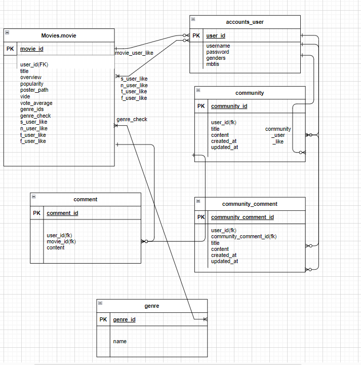

>

# Final Project

 
 

# 1. 팀원 정보 및 업무 분담 내역

## 팀장 : 조찬익

- 공통 업무

  - 프로젝트 기획
  - 전체 레이아웃 구성
  - ERD 설계

- 주요 업무

  - vue(70%), django(30%)
  - 백엔드 데이터를 받아와 프론트엔드 기능 구현 및 디버깅, 테스트, 디자인

- 세부사항
  - 전체 레이아웃 구성
  - 홈페이지 디자인(css)
  - 홈페이지 메인 영상
  - Login, Signup 페이지(vue)
  - 서버로부터 API 받아오기
  - 영화 Detail 페이지 구현
  - 영화 Detail 페이지 Comment 구현
  - Vue 구조 설계(Component, Router)
  - Django Genre 부분 Modeling
  - Django Genre, movie_detail 구현

---

## 팀원 : 서용준

- 공통 업무

  - 프로젝트 기획
  - 전체 레이아웃 구성
  - ERD 설계

- 주요 업무

  - vue(30%), django(70%)
  - DB 모델링, 백엔드 데이터 로직

- 세부사항
  - 홈페이지 Community 게시판 구현
  - 홈페이지 User Profile 페이지 구현
  - Django Modeling
  - 좋아요 기능 구현
  - 좋아요를 바탕으로 영화 추천 알고리즘 구현
  - MBTI를 바탕으로 영화 추천 알고리즘 구현

---

# 2. 목표 서비스 구현 및 실제 구현 정도

- 목표 서비스(실제 구현 정도)
  - MBTI 중 S/N, T/F를 바탕으로 영화 추천 서비스 구현(50%)
  - 좋아요를 바탕으로 영화 추천 서비스 구현(80%)

---

# 3. 데이터베이스 모델링(ERD)

---

# 4. 영화 추천 알고리즘에 대한 기술적 설명

- 영화 좋아요를 바탕으로 한 영화 추천
  1. 유저가 좋아요를 누르면 백엔드 DB에 저장
  2. 좋아요를 누른 영화를 바탕으로 같은 장르 영화를 랜덤으로 추출(10개)하고 추천
  3. 좋아요가 없으면 무작위로 10개 추출해서 추천
- MBTI를 바탕으로 한 영화 추천
  1. 유저가 가입시 MBTI를 입력, MBTI 중 S/N, T/F만 입력하도록 함
  2. 유저가 좋아요를 누를 때마다 백엔드 DB에 저장
  3. 다른 유저들이 좋아요를 누른 데이터를 바탕으로 같은 MBTI인 유저들의 좋아요한 영화를 랜덤으로 추출
  4. ST, SF, NT, NF 별로 추천함

---

# 5. 서비스 대표 기능에 대한 설명

- 메인 페이지에서 추천 영화 영상 보여주기
- 프로필에 들어가면 유저가 좋아요를 누른 영화를 바탕으로 영화 추천( MBTI, 좋아요를 한 영화 장르를 바탕으로 랜덤 추천)
- 영화 상세 페이지를 들어가면 트레일러 영상을 보러갈 수 있음.

# 6. 느낀점, 후기

### 서용준

- 싸피 첫 프로젝트를 해본 결과, 할 수 있다는 자신감과 함께 아직 부족하다는 것을 많이 느꼈습니다. 무엇보다 프론트엔드 부분(vue)와 비동기, 동기 통신에 대해 공부를 해야겠다는 필요성을 느꼈습니다.
   
  수업시간에 매번 따라가기 급급하고, 거의 코드를 복붙수준으로 하다보니 제대로 이해하지 못한 부분이 많았습니다. 그로 인해, 홈페이지 구현하면서 오류가 많이 발생했고, 디버깅하는데 많은 시간이 걸렸습니다.
   
  그리고 구현할 수 있을 것이라 생각했던 기능이 생각보다 다른 곳에서 시간이 걸리다보니 제대로 구현해내지 못해서 너무 아쉬웠습니다.
   
  다음 프로젝트 때까지 지금 부족하다고 느꼈던 부분을 더 공부하고 코드 흐름을 제대로 이해해야겠다는 생각이 들었습니다.
   
  마지막으로 팀장과 함께 프로젝트를 진행하면서, 서로 손발을 맞추고, 서로가 부족한 부분을 도와주면서 즐겁게 그리고 100% 만족할 수는 없지만 어떤 결과물을 냈다는 것에 만족합니다. 팀장님 고생많았습니다!

 
 
 

### 조찬익

- 벌써 1학기가 끝났다는 것이 아직도 믿겨지지 않습니다.
 
싸피를 다니면서 제 자신이 너무나 부족하다는 것을 깨달았습니다. 시간이 지날수록 코드를 따라치는 횟수가 늘어나게 되고 그렇게 마지막 관통프로젝트를 무사히 완수할 수 있을까 걱정을 많이 했습니다. 
 
하지만 걱정만 한다고 해서 프로젝트가 완성되지 않는다는 것을 알고 있기에 전에 배웠던 것을 참고하면서 구현해나가기 시작했습니다. 
 
제일 뿌듯했던 점은 금요일마다 진행했던 프로젝트 중 당시에는 장르별로 데이터를 불러오지 못했는데 이번 관통프로젝트에서는 완벽하게 성공했다는 점입니다.
 
이번에 같이 프로젝트를 함께 해준 용준이 형에게 정말 진심으로 감사의 말을 올리고 싶습니다. 제가 기능 구현에 실패할 때마다 할 수 있다는 자신감을 불어넣어주었고 먼저 도맡아서 해준 덕분에 이 프로젝트는 무사히 끝날 수 있었습니다.
 
감사한 사람들이 많았던 1학기 였습니다. 1달여 간의 시간을 계획적으로 잘 보내서 2학기에는 제가 감사한 사람이 되었으면 좋겠습니다. 다들 수고많으셨습니다! :)